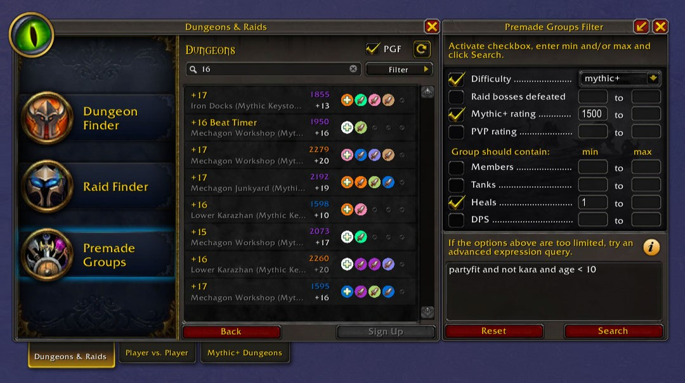

# Premade Groups Filter

Premade Groups Filter helps you limit the search results of the LFG Premade Groups tool. You can filter by difficulty or for groups with a specific composition of members, e.g. one tank, no heals and 3 dps. Filtering is done using a separate window next to the list of groups. Advanced users are able to enter powerful filter expressions to find exactly what they are looking for.

Examples of what can easily be found with Premade Groups Filter:

* Mythic dungeon groups that still need a healer
* Raids that have not yet defeated any bosses and already have more than 10 members and an item level requirement of 300
* Arena 3v3 groups where the leader has a minimum rating of 1500

### Standard Filters

* Difficulty (Normal, Heroic, Mythic, Mythic+, Arena 2v2, Arena 3v3)
* Number of raid bosses defeated
* Mythic+ Rating
* PvP Rating
* Number of members
* Number of tanks, heals and DPS

### Advanced Expression Query Box

* Unlimited filtering by over 150 properties ([see full list of keywords](https://github.com/0xbs/premade-groups-filter/wiki/Keywords))
* Enter powerful logic filter expressions
* Sort by multiple properties ascending or descending
* Learn Lua while searching for groups

### Additional UI Enhancements

* **Class Names in Tooltip** - Shows a list of classes by role in the tooltip of a premade group.
* **Colored Group Name** - Shows group name in green if group is new and in red if you've previously been declined. Shows activity name in red if you have a lockout on that instance.
* **Colored Applications** - Shows a red background on pending applications for Mythic+ groups if the group has no slot left for your role.
* **Circle in Class Color** - Shows a circle in class color in the background of each role in the premade dungeon group list.
* **Bar in Class Color** - Shows a small bar in class color below each role in the premade dungeon group list.
* **Show Group Leader** - Shows a small crown above the group leader's role in the premade dungeon group list.
* **Group Leader Rating** - Shows the Mythic+ or PvP rating of the group leader in the premade group list.
* **One Click Sign Up** - Sign up for a group directly by clicking on it, instead of selecting it first, then clicking sign up.
* **Persist Sign Up Note** - Persists the 'note to the group leader' when signing up to different groups. By default, the note is deleted when a new group is selected.
* **Sign Up On Enter** - Automatically focus the 'note to the group leader' text box when signing up for a new group and confirm your application by pressing enter.
* **Skip Sign Up Dialog** - Skip the role and note prompt if possible and immediately sign up to the group. Hold shift to always show the dialog.

### Resources

* [Project on CurseForge](https://www.curseforge.com/wow/addons/premade-groups-filter)
* [Project on Wago.io](https://addons.wago.io/addons/premade-groups-filter)
* [Full List of Keywords](https://github.com/0xbs/premade-groups-filter/wiki/Keywords "Full List of Keywords")
* [FAQ and Examples](https://github.com/0xbs/premade-groups-filter/wiki/FAQ "FAQ and Examples")

### License

The software is provided under the GNU General Public License, Version 2. See the `LICENSE` file for details.
